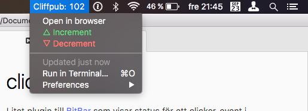

# bitbar-clicker
Litet plugin till [BitBar](https://getbitbar.com) som visar status för ett clicker-event i menyraden på macOS.

## How to
1. Skaffa BitBar: [getbitbar.com](https://getbitbar.com)
2. Ladda ner skriptet `clicker.5s.sh` och dumpa i plugin-mappen.
	* `5s` i namnet är hur ofta det uppdateras. Bara att byta om man inte är nöjd.

*Allt måste inte vara CoffeeScript eller Ruby för att få finnas, Aron.*
